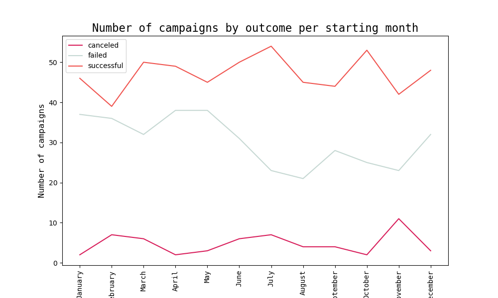
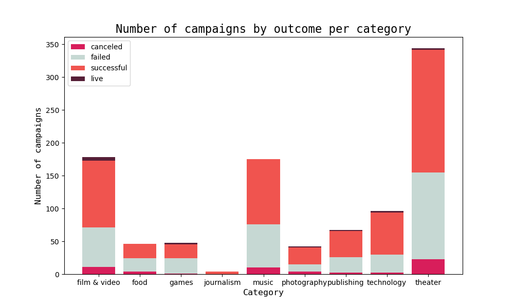

# ds_project_2_group_19
Data Science Bootcamp Project 2

## Data Origin
1. Crowdfunding Data: Excel table with 1000 projecs that included: description, funding goal, pledged amount, outcome of the campaign, campaign launch date, campaign end date, category and sub-category, etc.
2. Contact Data: List of dictionaries holding contact information for each campaign. The lists included the campaign id, the contact person's name, and their email.

## Purpose of the Project
1. Database Design: Practice creating a database schema with primary and foreign key constraints, null and data type constraints, and a last_updated column to track when new values are added to the database.
2. ETL Pipeline: Develop an ETL pipeline to extract data from the source, transform it to fit the database schema, and load it into the database.
3. Analysis: Use the database to answer key questions

## Tools and Libraries Used
1. QuickDB
2. SQLAlchemy\
2.1 automap_base\
2.2 Session\
2.3 extract\
2.4 create_engine\
2.5 text\
2.6 inspect\
2.7 func
3. PostgreSQL
4. Jupyter Notebooks
5. Pandas
6. Numpy
7. Matplotlib
8. json

## Questions
1. Outcomes by Month that Projects were Started

2. Outcomes per Category

## Authors
1. Marta Baker
2. Paris Lee (parispotatoes)
3. Earl Lewis (earl9703)

## Works Cited
1. GeeksforGeeks. "Matplotlib - Setting Ticks and Tick Labels." GeeksforGeeks, GeeksforGeeks, 14 June 2021, www.geeksforgeeks.org/matplotlib-setting-ticks-and-tick-labels/.
2. Stack Overflow. "Insert a row to pandas dataframe." Stack Overflow, 18 June 2014, stackoverflow.com/a/24287210/23471668.
3. Stack Overflow. "How to reorder indexed rows based on a list in Pandas data frame." Stack Overflow, 3 May 2015, stackoverflow.com/a/30010004/23471668.